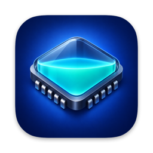
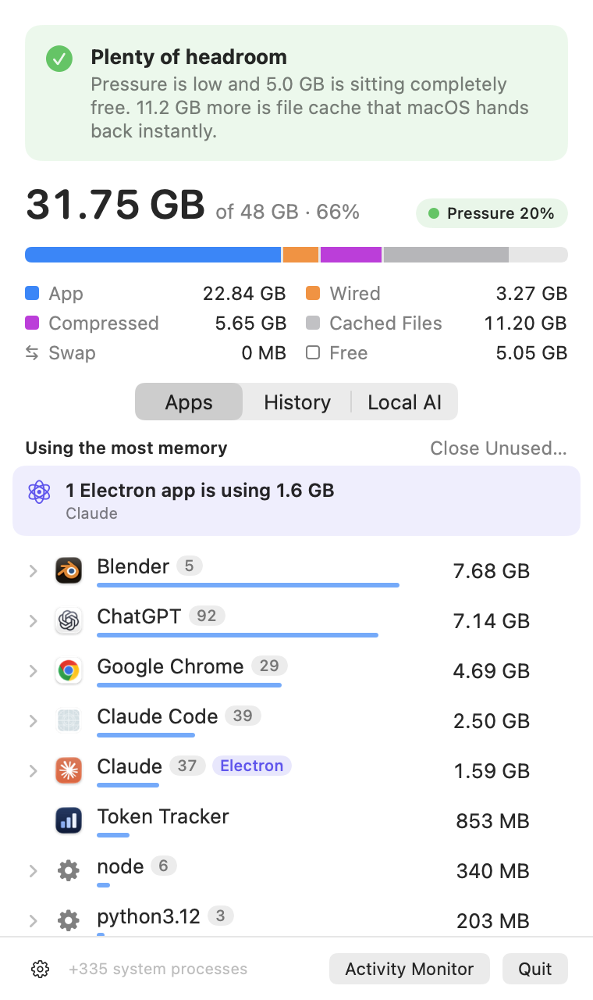
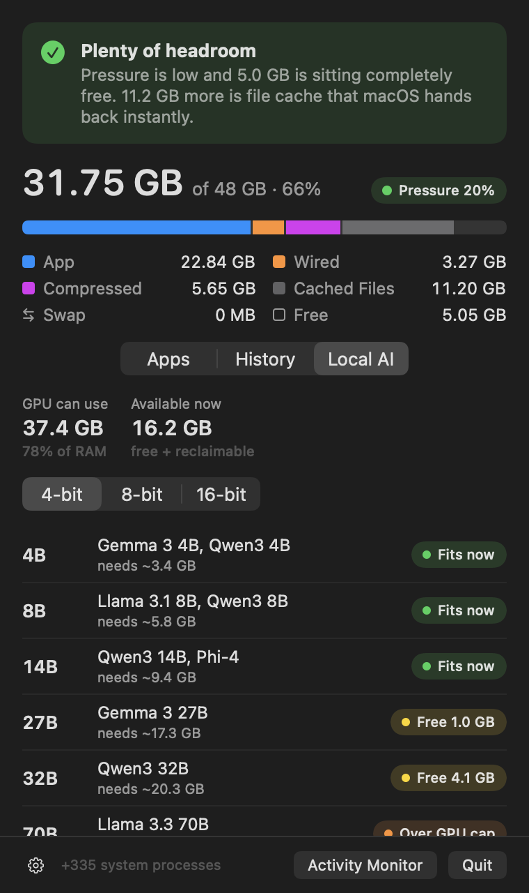
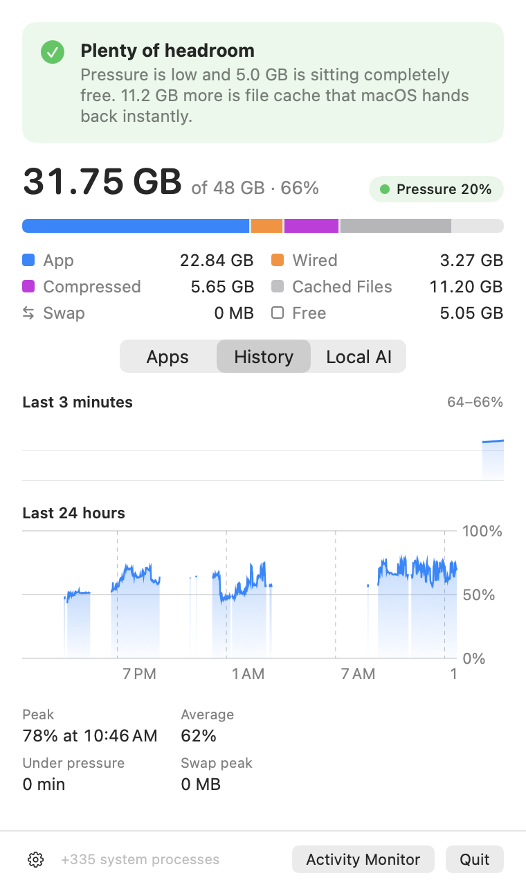

<p align="center">
  
</p>

<h1 align="center">Waterline</h1>

<p align="center">
  <b>A RAM monitor for Mac that tells you whether to worry.</b><br>
  Plain-English verdicts · memory-leak detection · room for local AI models · one-click quit
</p>

<p align="center">
  
  &nbsp;
  
</p>

---

Most memory monitors show a bar that's always nearly full and leave you to guess. But macOS *keeps* RAM full on purpose — of file cache it hands back instantly — so "90% used" usually means nothing. Waterline reads the signals that actually matter (memory pressure and swap growth) and tells you, in one sentence, whether your Mac is fine and what to do if it isn't.

## Features

- **A verdict, not just a number.** "Plenty of headroom — 22 GB of that is cache macOS hands back instantly." Or: "Memory is getting tight. Quitting Chrome would free about 6 GB."
- **Leak detection.** Waterline watches every app for an hour and flags the ones whose memory only ever goes up — the shape of a leak — with a notification: *"Slack keeps growing: +1.2 GB in 40 minutes."*
- **Local AI headroom.** On Apple Silicon the GPU shares RAM but is capped. Waterline shows that cap and tells you which model sizes (4B → 235B, at 4/8/16-bit) fit right now, fit if you close apps, or need the cap raised.
- **Free memory for real.** Quit any app from its row, end individual processes, or use **Close Unused…** to review background apps, select the ones you no longer need, and quit them normally. The review shows their estimated memory usage; it never assumes a background app is unnecessary, and save prompts remain available. No fake "RAM cleaner" buttons — quitting is the only thing that actually works, so that's what Waterline does. System-critical processes are protected.
- **Apps, not processes.** Chrome's 28 helpers, Safari's WebKit processes, and an editor's language servers are rolled up under the app responsible, with a per-app trend line.
- **Electron callout.** See at a glance which apps ship their own copy of Chromium and how much that costs.
- **24-hour history** with memory-pressure periods highlighted, plus peak, average, and swap stats.
- **Floating meter.** An optional always-on-top gauge you can park in any corner.
- **Lightweight and private.** ~0% CPU at idle (the full process scan only runs while the panel is open, plus every 30 s for leak detection). No network access, no analytics, no accounts.

<p align="center">
  
  &nbsp;
  
</p>

## Install

Pick the download for your Mac from [Releases](../../releases):

| Your Mac | Download |
| --- | --- |
| **Apple Silicon** (M1, M2, M3, M4…) | `Waterline-AppleSilicon.zip` |
| **Intel** | `Waterline-Intel.zip` |

Not sure? Apple menu → **About This Mac**: it says "Chip: Apple M…" or "Processor: …Intel…". Unzip, then drag **Waterline.app** to Applications. Requires macOS 14 Sonoma or later.

> The release build isn't notarized yet, so the first time you open it macOS will say it can't verify the developer. Right-click the app → **Open** → **Open**. You only need to do this once.

On Intel Macs everything works the same, except the Local AI tab: Intel GPUs don't share RAM, so it sizes models against ordinary memory and notes that they'll run mostly on the CPU.

**Build from source** (needs Xcode or just the Command Line Tools, Swift 6.2+, macOS 14+):

```bash
git clone https://github.com/Chinchuan24/waterline.git
cd waterline
./build.sh --install        # builds for your Mac's chip
./build.sh --all --zip      # both versions, as release zips
```

Then turn on **Start Automatically at Login** from the ⚙︎ menu in the panel.

## How the numbers work

Waterline uses the same counters as Activity Monitor, so the numbers match:

| Shown as | Source |
| --- | --- |
| Memory Used | App + Wired + Compressed (`host_statistics64`) |
| Cached Files | File-backed + purgeable pages — reclaimable, so not counted as used |
| Memory pressure | `kern.memorystatus_vm_pressure_level` and `kern.memorystatus_level` |
| Per-app memory | `phys_footprint` from `proc_pid_rusage`, summed across the app's processes |
| GPU memory cap | `iogpu.wired_limit_mb` if set, otherwise Metal's `recommendedMaxWorkingSetSize` |

**Leak detection** fits a least-squares line to each app's memory over the last hour. An app is flagged when it has grown ≥ 400 MB and ≥ 30% over at least 15 minutes, and the line fits well (R² ≥ 0.8) — so apps that grow and then free memory again aren't flagged.

**Model sizes** are estimates: weights (≈0.6 bytes/parameter at 4-bit, 1.07 at 8-bit, 2 at 16-bit) plus ~1 GB and 8% for the runtime and an ~8K-token context.

## Command line

```bash
Waterline --json      # machine-readable reading: memory, verdict, GPU cap, every app and process
Waterline --dump      # the same, human-readable
```

From a build: `.build/release/Waterline --json`, or `/Applications/Waterline.app/Contents/MacOS/Waterline --json`.

## Limitations

- macOS only lets an app measure processes you own, so system processes such as `kernel_task` and `WindowServer` aren't listed. They're still counted in Memory Used.
- Grouping helpers under their app uses `responsibility_get_pid_responsible_for_pid`, the same private API Activity Monitor uses. If a future macOS removes it, Waterline falls back to grouping by app bundle. It also means Waterline can't be sold on the Mac App Store, which is fine — it's free and open source.

## Development

```bash
swift build                       # debug build
scripts/test.sh                   # run the tests (Swift Testing)
.build/debug/Waterline --snapshot ./shots   # render every screen to PNG, light and dark
swift scripts/make-icon.swift Resources/AppIcon-source.png Resources/AppIcon.icns
```

The code is split into **`WaterlineCore`** — measurement and analysis with no UI, fully unit-tested — and **`Waterline`**, the SwiftUI menu bar app. See [CONTRIBUTING.md](CONTRIBUTING.md).

## License

[MIT](LICENSE). The app icon artwork was generated with Higgsfield and is included under the same license.

### Automatic startup

In Waterline, click the gear icon and check **Start Automatically at Login**. Waterline will open after you sign in to your Mac. Uncheck it to disable startup. If macOS needs approval, choose **Approve Startup in System Settings…**. Install Waterline in Applications before enabling this setting.
